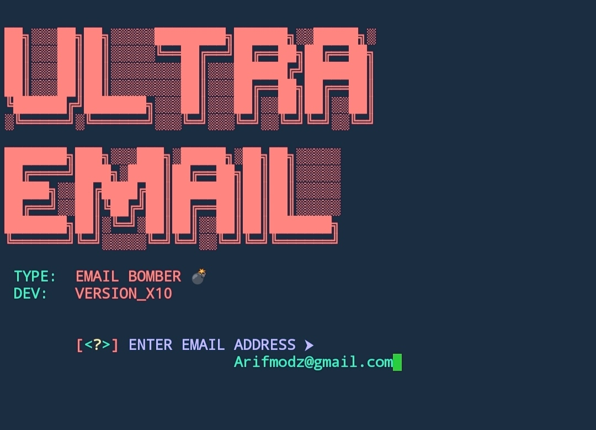

# ULTRA EMAIL BOMBER V1.0

### Hello, Welcome .. 
Hack Wifi ..Using  *X-10-WIFI-V2* by Termux/Android, ARIF-😫!!
  

  
 
# Tested On
- Termux

# Installation Command

* apt-get update -y

* apt-get upgrade -y

* pkg install python -y

* pip install requests

* pip install rich

* pip install httpx

* pip install bs4

* pkg install git -y

* git clone https://github.com/Versionx10/ULTRA-EMAIL.git

* cd Em-Bomber

* python3 em-bomber.py

`Enable Less Secure Apps.`

# ULTRA EMAIL BOMBER 

# Warning
***This tool is only for educational purpose. We are not responsible for any misuse or illegal activities.***
